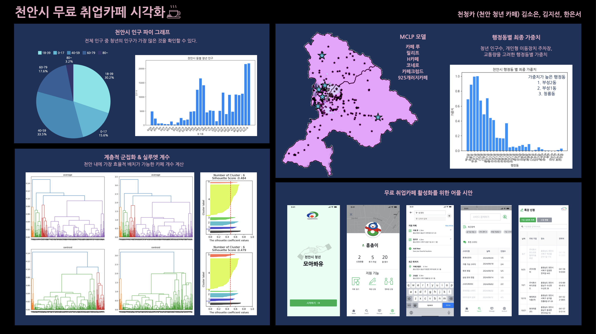

# cheonan_idea
2024년 천안시 데이터 분석 아이디어 경진대회

---

### 팀명
천청카 (천안 청년 카페)

---

### 주제
천안시 **청년 친화** 및 **일자리 확대**를 위한 무료 취업카페 입지선정

---

### 🙆‍♀️🙆‍♀️🙆‍♀️
김소은: 이화여자대학교 커뮤니케이션 미디어학부   
김지선: 이화여자대학교 소프트웨어학부 사이버보안전공  
한은서: 이화여자대학교 통계학과  

---

